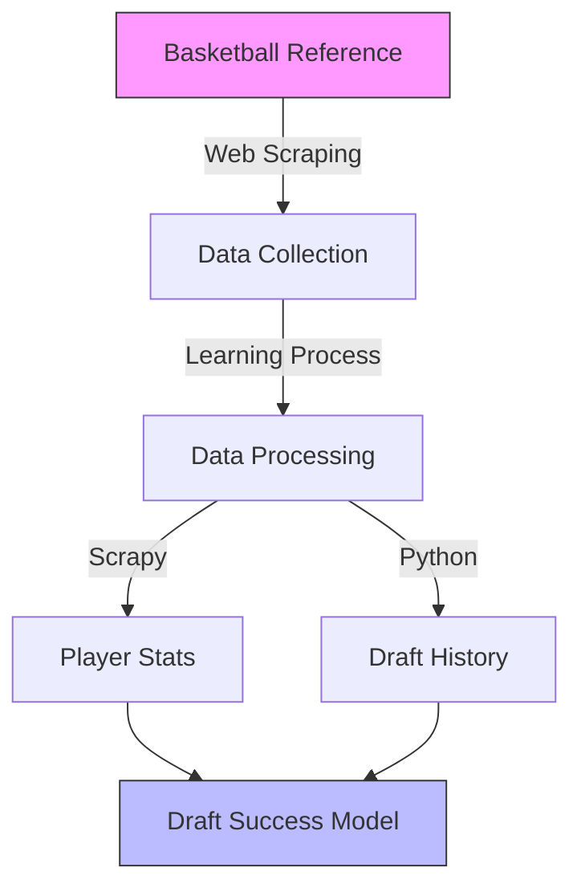

<div align="center">

# 🏀 NBA Draft Data Scraper 

[](https://www.python.org/)
[](https://scrapy.org/)
[](https://pandas.pydata.org/)
[](https://github.com/yourusername)
[](https://opensource.org/licenses/)

> A web scraping learning project to automate NBA draft data collection for my NBA Draft Success Model analysis

[Overview](#-overview) • [Features](#-features) • [Installation](#-installation) • [Learning Journey](#-learning-journey) • [Contributing](#-contributing)


</div>

## 📝 Overview

This repository documents my journey learning web scraping through building an NBA draft data collector. Created as a solution to the time-consuming manual data collection process for my main [NBA Draft Success Model](your-link-here) project.

### 🎯 Project Goals
- Learn web scraping fundamentals with Python & Scrapy
- Automate collection of historical NBA draft data
- Create reliable data pipeline for draft analysis
- Practice modern data engineering techniques

## 🌟 Features



### Current Capabilities
- 📊 Extract draft pick details and statistics
- 🔄 Handle multi-team season data
- 📈 Process career trajectories
- 🧹 Basic data cleaning and formatting

### Learning Targets
- 🎯 Rate limiting and ethical scraping
- 🔍 Advanced CSS selectors
- 🕷️ Scrapy best practices
- 🗃️ Efficient data storage

## ⚙️ Technical Architecture

### Development Stack
```python
# Core Technologies
STACK = {
    'Language': 'Python 3.8+',
    'Scraping': 'Scrapy 2.5',
    'Data Processing': 'Pandas',
    'Learning Resources': [
        'Scrapy Documentation',
        'Web Scraping Tutorials',
        'NBA Stats API Guides'
    ]
}
```

### Project Structure
```bash
NBA_Draft_Scraper/
├── 🕷️ spiders/
│   └── nba_draft_spider.py     # Where I'm learning Scrapy
├── 📊 data/
│   └── draft_data.csv          # Collected data
├── 📝 README.md                # Project documentation
├── 🔧 requirements.txt         # Dependencies
└── ⚙️ settings.py              # Scrapy configurations
```

## 🚀 Installation

```bash
# Clone this learning project
git clone https://github.com/yourusername/NBA_Draft_Scraper.git

# Setup development environment
cd NBA_Draft_Scraper
pip install -r requirements.txt

# Run the scraper
scrapy crawl nba_draft_spider -o data/draft_data.csv
```

## 📊 Data Collection

### Sample Data Structure
| Category | Description | Example | Learning Notes |
|----------|-------------|---------|----------------|
| `draft_year` | Year drafted | 2023 | Basic scraping |
| `player_stats` | Season averages | 15.5 PPG | Multi-page handling |
| `team_history` | Team changes | GSW → LAL | Data cleaning |
| `advanced_metrics` | Advanced stats | 18.2 PER | Complex queries |

## 📚 Learning Journey

### Progress Tracker
- [x] **Week 1:** Basic HTML parsing & Scrapy setup
- [x] **Week 2:** Handling pagination & nested data
- [ ] **Week 3:** Rate limiting & data validation
- [ ] **Week 4:** Error handling & recovery
- [ ] **Week 5:** Performance optimization

### Key Learnings
```python
lessons_learned = {
    'Technical': [
        'Web scraping fundamentals',
        'Data pipeline design',
        'Error handling patterns'
    ],
    'Personal Growth': [
        'Project planning',
        'Documentation practices',
        'Community engagement'
    ]
}
```

## 🔮 Future Directions

### Learning Goals
- [ ] Advanced Scrapy techniques
- [ ] Automated testing
- [ ] CI/CD implementation
- [ ] Data validation frameworks

### Project Evolution
- [ ] Enhanced error recovery
- [ ] Parallel processing
- [ ] API development
- [ ] Real-time updates

## 🤝 Contributing

As a learning project, I welcome:
- Code reviews and feedback
- Optimization suggestions
- Documentation improvements
- Learning resources

## ⚖️ License

MIT License - See `LICENSE` for details

## ⚠️ Disclaimer

This educational project follows Basketball Reference's terms of service and implements appropriate request delays.

---

<div align="center">

### 📚 Learning Web Scraping Through NBA Analytics

[](https://github.com/yourusername)
[](https://github.com/yourusername/NBA_Draft_Scraper/stargazers)

</div>